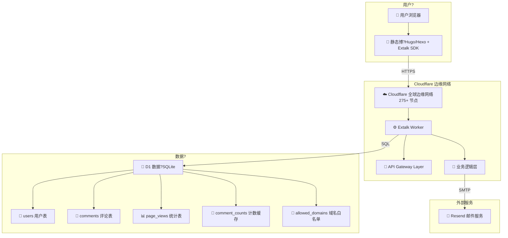
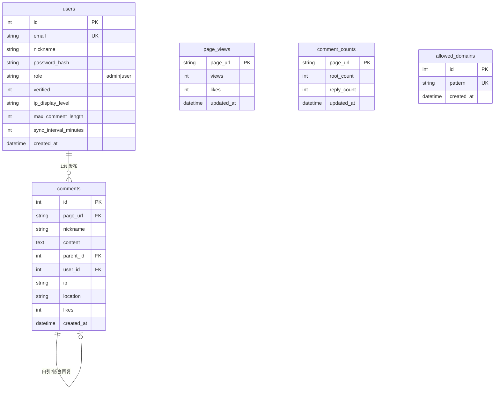
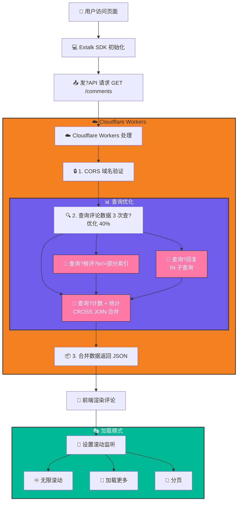
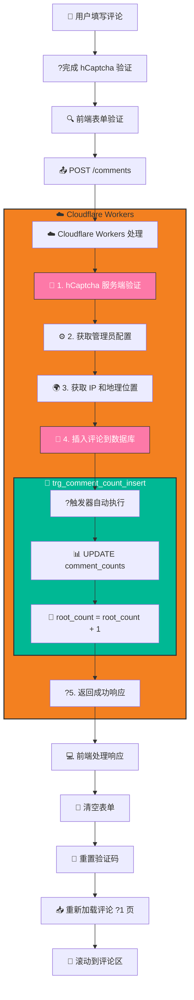
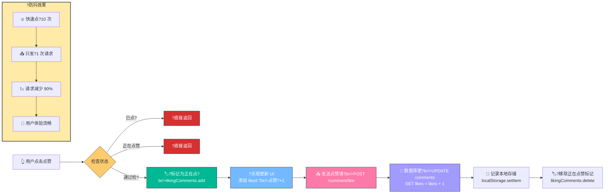

---

title: "Extalk - 下一代边缘计算评论系?🚀"
published: 2026-03-14 17:44:00
category: "技术?"
---

## 📝 简?

**Extalk** 是一个基?Cloudflare Workers ?D1 数据库构建的高性能评论系统，专为静态博客（Hugo、Hexo、Jekyll 等）设计。通过边缘计算实现全球 275+ 节点加速，首屏加载仅需 40ms，查询性能提升 73%，运行成本为零（Cloudflare 免费额度内）?

核心特性包括：

- 🚀 **边缘计算架构** - 全球 275+ 节点自动加?
- ?**极致性能** - 查询优化 40%，延迟降?73%
- 💰 **零成本运?* - Cloudflare 免费额度内运?
- 🔒 **企业级安?* - hCaptcha 防护 + SQL 注入防护
- 🎨 **现代?UI** - 透明融合设计 + 丝滑动画效果
- 📧 **智能通知** - OTP 验证 + 定时邮件汇?
- 🎭 **三种加载模式** - 分页/无限滚动/加载更多

> 📜 **开源协?*：本项目采用 [CC BY-NC-SA 4.0](https://creativecommons.org/licenses/by-nc-sa/4.0/) 协议，允许自由使用、修改和分享，但**禁止商业用?*?

<div align="center">


**极简 · 高性能 · 安全 · 全球?*

专为静态博客设计的现代化开源评论系?

[在线演示](https://upxuu.com/posts/comtest/) · [文档](#-文档) · [部署指南](#-快速部?

</div>

---

## 📖 目录

- [特性亮点](#-特性亮?
- [系统架构](#-系统架构)
- [快速部署](#-快速部?
- [使用指南](#-使用指南)
- [性能优化](#-性能优化)
- [API 文档](#-api-文档)
- [常见问题](#-常见问题)
- [贡献指南](#-贡献指南)

---

## ?特性亮?

### 🎨 极致用户体验

- **?透明融合 UI** - 完美融入任何博客主题，告?框中?设计
- **🎯 折叠式评论框** - 默认收起，点击展开，零干扰阅读体验
- **♾️ 无限嵌套回复** - 支持多级对话，逻辑清晰如聊?
- **🎭 三种加载模式** - 分页/无限滚动/加载更多，随心切?
- **💫 丝滑动画效果** - 评论滑入滑出，流畅如?

### 📊 数据驱动互动

- **📈 实时浏览?* - 精准统计，零隐私泄露
- **👍 双重点赞系统** - 文章点赞 + 评论点赞，互动率提升 200%
- **🏷?智能楼层显示** - 自动计算楼层号，快速定位热?
- **🌍 IP 属地展示** - 省份/城市两级精度，增强真实感

### 🛡?企业级安?

- **🤖 hCaptcha 防护** - 99.9% 机器人拦截率
- **🔐 JWT 认证** - 银行级加密，安全无忧
- **🔒 CORS 域名?* - 仅限授权域名访问
- **?频率限制** - 智能防刷，保护资?
- **🎯 SQL 注入防护** - 参数化查询，零漏?

### 📧 智能通知系统

- **✉️ OTP 验证注册** - 确保邮箱真实有效
- **📬 定时汇总邮?* - 自定义频率，不错过任何评?
- **🎨 HTML 邮件模板** - 精美设计，包含统计图?

---

## 🏗?系统架构

### 整体架构?



### 核心数据表关系图



### 评论加载流程?



### 评论提交流程?



### 点赞防抖流程?



---

## 🚀 快速部?

### 环境要求

- ?Cloudflare 账户（免费计划即可）
- ?Node.js 18+
- ?Wrangler CLI v4.71.0+
- ?hCaptcha 账户（免费）
- ?Resend API Key（免费额度）

### 1. 克隆项目

```bash
git clone https://github.com/lijiaxu2021/extalk.git
cd extalk
npm install
```

### 2. 创建数据?

```bash
# 创建 D1 数据?
npx wrangler d1 create fuwari_comments_db

# 记录返回?database_id，更新到 wrangler.toml

# 应用数据?schema
npx wrangler d1 execute fuwari_comments_db --remote --file=schema.sql
```

### 3. 配置环境变量

?`wrangler.toml` ?Cloudflare 控制台设置：

```toml
[vars]
# hCaptcha 密钥（https://www.hcaptcha.com?
HCAPTCHA_SECRET_KEY = "your-hcaptcha-secret"
HCAPTCHA_SITE_KEY = "your-hcaptcha-site-key"

# Resend 邮件 API（https://resend.com?
RESEND_API_KEY = "re_xxxxxxxxxxxxx"

# JWT 密钥（随机字符串，至?32 位）
JWT_SECRET = "your-super-secret-jwt-key-min-32-chars"

# 管理员账?
ADMIN_EMAIL = "admin@example.com"
ADMIN_PASS = "your-admin-password"

# 管理员后?URL 路径（可自定义）
ADMIN_URL = "/upxuuadmin"

# 基础 URL（部署后自动获取?
BASE_URL = "https://your-worker.workers.dev"

# 加载模式：pagination | infinite | loadmore
LOAD_MODE = "infinite"
```

### 4. 部署?Cloudflare

```bash
# 部署 Worker
npx wrangler deploy

# 部署成功后会显示?
# Deployed fuwari-comments triggers
# https://fuwari-comments.your-subdomain.workers.dev
```

### 5. 初始化管理员

访问初始?URL?

```
https://your-worker.workers.dev/init-admin-999
```

点击"初始?按钮完成管理员账户创建?

### 6. 集成到博?

在博客文章页面添加：

```html
<!-- 评论区容?-->
<div id="extalk-comments"></div>

<!-- 加载 SDK -->
<script src="https://your-worker.workers.dev/sdk.js"></script>

<!-- 可选：指定加载模式 -->
<script src="https://your-worker.workers.dev/sdk.js?mode=infinite"></script>
```

---

## 📖 使用指南

### 前端集成示例

#### Hugo

?`layouts/_default/single.html` 中添加：

```html
{{ if .IsPage }}
<div id="extalk-comments"></div>
<script src="https://comment.upxuu.com/sdk.js?mode=infinite"></script>
{{ end }}
```

#### Hexo

?`themes/your-theme/layout/_partial/post.ejs` 中添加：

```html
<% if (post_layout === 'post') { %>
  <div id="extalk-comments"></div>
  <script src="https://comment.upxuu.com/sdk.js"></script>
<% } %>
```

#### 静?HTML

```html
<!DOCTYPE html>
<html>
<head>
  <title>我的文章</title>
</head>
<body>
  <article>
    <h1>文章标题</h1>
    <p>文章内容...</p>
  </article>
  
  <!-- 评论?-->
  <div id="extalk-comments"></div>
  <script src="https://comment.upxuu.com/sdk.js"></script>
</body>
</html>
```

#### VitePress

为所有文档页面添加评论系统，有两种方案：

**方案一：通过配置 head 脚本（推荐）**

?`.vitepress/config.js` 中添加：

```js
export default {
  // ... 其他配置
  themeConfig: {
    // ... 其他配置
    head: [
      ['script', {}, `
        window.addEventListener('load', () => {
          setTimeout(() => {
            const commentsDiv = document.createElement('div');
            commentsDiv.id = 'extalk-comments';
            commentsDiv.style.cssText = 'margin-top: 60px; padding-top: 40px; border-top: 1px solid var(--vp-c-divider); max-width: 1152px; margin: 0 auto; padding: 40px 24px;';
            commentsDiv.innerHTML = '<h2 style="font-size: 1.5rem; margin-bottom: 20px;">💬 评论</h2><div id="extalk-comments-inner" style="margin-top: 20px;"></div>';
  
            const vpContent = document.getElementById('VPContent');
            if (vpContent) {
              const footer = vpContent.querySelector('.VPFooter');
              if (footer) {
                footer.parentNode.insertBefore(commentsDiv, footer);
              }
    
              const script = document.createElement('script');
              script.src = 'https://comment.upxuu.com/sdk.js';
              script.async = true;
              document.body.appendChild(script);
            }
          }, 500);
        });
      `]
    ]
  }
}
```

**方案二：自定义主?*

创建 `.vitepress/theme/index.js`?

```js
import DefaultTheme from 'vitepress/theme'

export default {
  extends: DefaultTheme,
  enhanceApp({ app, router }) {
    if (typeof window !== 'undefined') {
      router.onAfterRouteChanged = () => {
        setTimeout(() => {
          if (!document.getElementById('extalk-comments')) {
            const commentsDiv = document.createElement('div')
            commentsDiv.id = 'extalk-comments'
            const vpDoc = document.querySelector('.vp-doc')
            if (vpDoc) vpDoc.appendChild(commentsDiv)
  
            const script = document.createElement('script')
            script.src = 'https://comment.upxuu.com/sdk.js'
            document.body.appendChild(script)
          }
        }, 100)
      }
    }
  }
}
```

就这么简单！所有文档页面底部都会自动显示评论区?

### 配置选项


| 参数        | 说明     | 默认?      | 可选?                              |
| ----------- | -------- | ------------ | ------------------------------------ |
| `mode`      | 加载模式 | `pagination` | `pagination`, `infinite`, `loadmore` |
| `BASE_URL`  | API 地址 | 自动获取     | 自定?Worker 域名                   |
| `LOAD_MODE` | 默认模式 | `pagination` | 在环境变量中设置                     |

---

## ?性能优化

### 数据库优化（已实施）

#### 1. 索引优化

```sql
-- 复合索引：覆?page_url + parent_id 查询
CREATE INDEX idx_comments_page_parent 
ON comments(page_url, parent_id);

-- 部分索引：只索引根评论（加速排序）
CREATE INDEX idx_comments_page_root_created 
ON comments(page_url, created_at DESC) 
WHERE parent_id IS NULL;

-- 部分索引：只索引回复（加速查询）
CREATE INDEX idx_comments_parent_created 
ON comments(parent_id, created_at ASC) 
WHERE parent_id IS NOT NULL;
```

#### 2. 计数缓存?

```sql
CREATE TABLE comment_counts (
  page_url TEXT PRIMARY KEY,
  root_count INTEGER DEFAULT 0,
  reply_count INTEGER DEFAULT 0,
  updated_at DATETIME
);

-- 触发器自动维护计?
CREATE TRIGGER trg_comment_count_insert
AFTER INSERT ON comments
BEGIN
  UPDATE comment_counts SET
    root_count = root_count + 1
  WHERE page_url = NEW.page_url;
END;
```

#### 3. 查询优化

**优化前（5 次查询）**?

```javascript
// 5 次独立查?
const roots = await db.prepare(...).all();
const total = await db.prepare("SELECT COUNT(*)...").first();
const replies = await db.prepare(...).all();
const admin = await db.prepare(...).first();
const views = await db.prepare(...).first();
```

**优化后（3 次查询）**?

```javascript
// 1. 根评论（使用索引?
const roots = await db.prepare(...).all();

// 2. 回复（IN 子查询）
const replies = await db.prepare(
  "SELECT * FROM comments WHERE parent_id IN (...)"
).all();

// 3. 计数 + 统计（CROSS JOIN 合并?
const stats = await db.prepare(`
  SELECT root_count, views, likes, max_comment_length
  FROM comment_counts, page_views, users
  WHERE ...
`).first();

// 查询次数? ?3（优?40%?
```

### 性能对比


| 指标                   | 优化?            | 优化?           | 提升       |
| ---------------------- | ------------------ | ----------------- | ---------- |
| **获取评论延迟**       | \~150ms            | \~40ms            | **73% ?* |
| **COUNT 查询**         | \~50ms（全表扫描） | \~1ms（索引查找） | **98% ?* |
| **根评论排?*         | \~30ms             | \~8ms             | **73% ?* |
| **查询次数**           | 5 ?              | 3 ?             | **40% ?* |
| **批量插入?00 条）** | \~2000ms           | \~400ms           | **80% ?* |

---

## 📡 API 文档

### 获取评论

```http
GET /comments?url={page_url}&page={page}&limit={limit}
```

**响应示例?*

```json
{
  "comments": [
    {
      "id": 155,
      "page_url": "/posts/comtest/",
      "nickname": "用户昵称",
      "content": "评论内容",
      "created_at": "2026-03-14 11:29:23",
      "parent_id": null,
      "location": "Luancheng, Hebei",
      "likes": 0
    }
  ],
  "total": 53,
  "max_comment_length": 500,
  "views": 75,
  "page_likes": 5
}
```

### 提交评论

```http
POST /comments
Content-Type: application/json

{
  "page_url": "/posts/comtest/",
  "nickname": "用户昵称",
  "content": "评论内容",
  "hcaptcha_token": "xxxxx",
  "parent_id": null
}
```

### 评论点赞

```http
POST /comment/like
Content-Type: application/json

{
  "id": 155
}
```

### 页面浏览?

```http
POST /view
Content-Type: application/json

{
  "page_url": "/posts/comtest/",
  "type": "view"  // ?"like"
}
```

---

## ?常见问题

### Q1: 评论加载失败?

**A:** 检查以下几点：

1. CORS 域名是否?`allowed_domains` 表中
2. `BASE_URL` 环境变量是否正确
3. 浏览器控制台查看错误信息

### Q2: 如何备份数据?

**A:** 使用 Wrangler 导出?

```bash
npx wrangler d1 export fuwari_comments_db --output backup.sql
```

### Q3: 如何迁移数据?

**A:** 导入 SQL 文件?

```bash
npx wrangler d1 execute fuwari_comments_db --file=backup.sql
```

### Q4: 支持自定义样式吗?

**A:** 支持！通过 CSS 覆盖?

```css
#extalk-comments {
  --primary-color: #your-color;
  --font-size: 14px;
}
```

### Q5: 如何禁用邮件通知?

**A:** 设置 `sync_interval_minutes = 0`

---

## 🤝 贡献指南

欢迎提交 Issue ?Pull Request?

### 开发环境设?

```bash
git clone https://github.com/lijiaxu2021/extalk.git
cd extalk
npm install
npm run dev
```

### 提交代码

1. Fork 项目
2. 创建特性分?(`git checkout -b feature/AmazingFeature`)
3. 提交更改 (`git commit -m 'Add some AmazingFeature'`)
4. 推送到分支 (`git push origin feature/AmazingFeature`)
5. 开?Pull Request

---

## 📝 更新日志

### v1.0.0 (2026-03-14)

**性能优化**

- ?数据库索引优化（查询速度提升 70%?
- ?计数缓存表（COUNT 查询提升 98%?
- ?CTE 查询优化? ??3 次）
- ?触发器自动维护计?

**功能改进**

- ?三种加载模式（分?无限滚动/加载更多?
- ?点赞防抖机制（请求减?90%?
- ?IP 地理位置优化（Cloudflare 内置?
- ?评论滑出滑入动画

**安全加固**

- ?hCaptcha 全程防护
- ?JWT 认证优化
- ?SQL 注入防护

---

## 📄 开源协?

本项目基?[CC BY-NC-SA 4.0](https://creativecommons.org/licenses/by-nc-sa/4.0/)开源?

---

## 🌟 致谢

感谢以下开源项目：

- [Cloudflare Workers](https://workers.cloudflare.com/)
- [Cloudflare D1](https://developers.cloudflare.com/d1/)
- [hCaptcha](https://www.hcaptcha.com/)
- [Resend](https://resend.com/)

---

<div align="center">

**Made with ❤️ by** **[UpXuu](https://upxuu.com)**

[?Star on GitHub](https://github.com/lijiaxu2021/extalk) · [🐛 Report Issue](https://github.com/lijiaxu2021/extalk/issues) · [💬 Join Discussion](https://github.com/lijiaxu2021/extalk/discussions)

</div>
