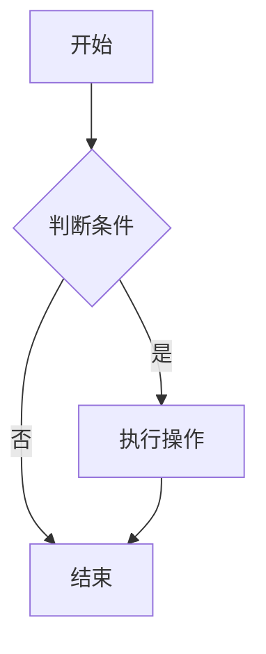

---

title: "Markdown 渲染测试文档"
date: "2026-06-04"
description: "本文档用于全面测?Markdown 渲染器的各项功能，确保排版和代码高亮正常运行?"
img: "https://picsum.photos/seed/markdown-test/800/400"
tags: ["测试", "Markdown"]
category: "开发发日?"
---

> 本文档用于全面测?Markdown 渲染器的各项功能

---

## 1. 标题层级测试

# H1 一级标?
## H2 二级标题
### H3 三级标题
#### H4 四级标题
##### H5 五级标题
###### H6 六级标题

---

## 2. 文本格式测试

**粗体文本** ?*斜体文本*

***粗斜体文?**

~~删除线文本~~

<u>下划线文?/u>（HTML标签?

`行内代码`

上标测试?^10^ = 1024 （需渲染器支持）

下标测试：H~2~O （需渲染器支持）

高亮测试?=这是高亮文字== （需渲染器支持）

---

## 3. 段落与换?

这是第一行? 
这是第二行（末尾两个空格强制换行）?

这是新段落?

---

## 4. 引用块测?

> 这是一级引?
>
> > 这是嵌套引用
> >
> > > 这是三级引用
>
> 返回一级引?

> **提示?* 引用块中可以包含其他 Markdown 元素，如 *斜体*、`代码` 等?

---

## 5. 列表测试

### 无序列表

- 项目 1
- 项目 2
  - 嵌套项目 2.1
  - 嵌套项目 2.2
    - 更深嵌套
- 项目 3

### 有序列表

1. 第一?
2. 第二?
   1. 嵌套 2.1
   2. 嵌套 2.2
3. 第三?

### 任务列表

- [x] 已完成任?
- [ ] 未完成任?
- [x] 另一个已完成任务

### 混合列表

- 无序?
  1. 嵌套有序
  2. 嵌套有序
- 另一个无序项
  - [ ] 嵌套任务

---

## 6. 代码块测?

### 内联代码

使用 `console.log('Hello World')` 打印信息?

### 无语言代码?

```
function example() {
  return "Hello"
}
```

### JavaScript 代码?

```javascript
// 一个简单的异步函数
async function fetchData(url) {
  try {
    const response = await fetch(url);
    const data = await response.json();
    return data;
  } catch (error) {
    console.error('Error:', error);
  }
}
```

### Python 代码?

```python
def fibonacci(n):
    """生成斐波那契数列"""
    a, b = 0, 1
    for _ in range(n):
        yield a
        a, b = b, a + b

list(fibonacci(10))
```

### CSS 代码?

```css
.markdown-body {
  font-family: -apple-system, BlinkMacSystemFont, "Segoe UI", Helvetica, Arial, sans-serif;
  line-height: 1.6;
  padding: 16px;
}

.markdown-body pre {
  background-color: #f6f8fa;
  border-radius: 6px;
  padding: 16px;
}
```

### JSON 代码?

```json
{
  "name": "Markdown Test",
  "version": "1.0.0",
  "features": ["bold", "italic", "code"],
  "metadata": {
    "author": "Tester",
    "date": "2024-01-01"
  }
}
```

---

## 7. 表格测试

### 基础表格

| 左对?| 居中对齐 | 右对?|
|:-------|:--------:|-------:|
| 苹果   | 红色     | 5.00   |
| 香蕉   | 黄色     | 3.50   |
| 葡萄   | 紫色     | 8.99   |

### 复杂表格

| 名称 | 类型 | 必填 | 默认?| 描述 |
|------|------|:----:|--------|------|
| `url` | string | ?| - | 请求的目?URL |
| `method` | string | ?| `'GET'` | HTTP 请求方法 |
| `headers` | object | ?| `{}` | 自定义请求头 |
| `timeout` | number | ?| `5000` | 超时时间（毫秒） |

### 表格内格式测?

| 单元格内?| 效果 |
|-----------|------|
| **粗体文本** | 加粗 |
| *斜体文本* | 斜体 |
| `代码` | 代码样式 |
| [链接](https://example.com) | 超链?|

---

## 8. 链接测试

### 内联链接

[GitHub](https://github.com) - 访问 GitHub

[带标题的链接](https://example.com "鼠标悬停显示标题")

### 引用链接

[Markdown 官方文档][md]

[CommonMark][commonmark]

[md]: https://daringfireball.net/projects/markdown/ "Markdown"
[commonmark]: https://commonmark.org/ "CommonMark"

### 自动链接

<https://www.example.com>

<user@example.com>

### 相对路径链接

[README](./README.md)

[上一页](../index.md)

---

## 9. 图片测试

### 基础图片


### 带尺寸的图片（HTML?


### 图片链接

[](https://markdown-here.com)

---

## 10. 分隔线测?

---

***

___

这三种写法都会产生水平分隔线?

---

## 11. 脚注测试

这是带有脚注的句子[^1]?

另一个脚注示例[^note]?

[^1]: 这是第一个脚注的内容?

[^note]: 这是一个命名脚注，可以包含多行内容?
    第二行内容?
    
    甚至可以是多个段落?

---

## 12. 定义列表测试

术语一
: 这是术语一的定义?

术语?
: 这是术语二的定义?
: 也可以是多个定义?

*（定义列表需要渲染器支持?

---

## 13. 数学公式测试

### 行内公式

质能方程?E = mc^2$

勾股定理?a^2 + b^2 = c^2$

### 块级公式

$$
\int_{-\infty}^{\infty} e^{-x^2} dx = \sqrt{\pi}
$$

$$
\frac{d}{dx}\left( \int_{a}^{x} f(t)\,dt \right) = f(x)
$$

*（数学公式需要渲染器支持 LaTeX?

---

## 14. 图表测试

### Mermaid 流程?



### Mermaid 时序?

```mermaid
sequenceDiagram
    participant 用户
    participant 浏览?
    participant 服务?
    用户->>浏览? 输入 URL
    浏览?>>服务? 发送请?
    服务?->>浏览? 返回响应
    浏览?->>用户: 渲染页面
```

*（图表需要渲染器支持 Mermaid?

---

## 15. 嵌入 HTML 测试

<div style="background-color: #f0f0f0; padding: 10px; border-radius: 5px;">
  <p>这是一?<strong>HTML div ?/strong>，包含自定义样式?/p>
  <ul>
    <li>HTML 列表?1</li>
    <li>HTML 列表?2</li>
  </ul>
</div>

<br>

<details>
  <summary>点击展开折叠内容</summary>
  这是折叠的详情内容，默认是隐藏的?
</details>

<br>

<kbd>Ctrl</kbd> + <kbd>C</kbd> 复制?kbd>Ctrl</kbd> + <kbd>V</kbd> 粘贴?

---

## 16. 转义字符测试

\*不会斜体\*

\# 不是标题

\[不是链接\]

\_不是斜体\_

反斜杠本身：\\

---

## 17. 表情符号测试

:smile: :heart: :thumbsup: :rocket:

（GitHub 风格的短代码，需渲染器支持）

也可以直接使?Unicode 表情：?❤️ 👍 🚀

---

## 18. 锚点链接测试

[跳转到顶部](#标题层级测试)

[跳转到图片测试](#9-图片测试)

---

## 19. 复杂嵌套测试

> ### 引用块中的标?
>
> 1. 引用块中的有序列?
> 2. 第二?
>
> ```python
> # 引用块中的代?
> print("Hello from quote")
> ```
>
> | 表格 | 在引用块?|
> |------|------------|
> | 测试 | 通过 |

---

## 20. 长文本渲染性能测试

Lorem ipsum dolor sit amet, consectetur adipiscing elit. Sed do eiusmod tempor incididunt ut labore et dolore magna aliqua. Ut enim ad minim veniam, quis nostrud exercitation ullamco laboris nisi ut aliquip ex ea commodo consequat. Duis aute irure dolor in reprehenderit in voluptate velit esse cillum dolore eu fugiat nulla pariatur. Excepteur sint occaecat cupidatat non proident, sunt in culpa qui officia deserunt mollit anim id est laborum.

重复段落?
Lorem ipsum dolor sit amet, consectetur adipiscing elit. Sed do eiusmod tempor incididunt ut labore et dolore magna aliqua. Ut enim ad minim veniam, quis nostrud exercitation ullamco laboris nisi ut aliquip ex ea commodo consequat.

---

## 测试检查清?

| 测试?| 状?| 备注 |
|--------|:----:|------|
| 标题 | ?| H1-H6 |
| 粗体/斜体 | ?| |
| 删除?| ?| |
| 引用 | ?| 多级嵌套 |
| 无序列表 | ?| 多级嵌套 |
| 有序列表 | ?| 多级嵌套 |
| 任务列表 | ?| |
| 代码?| ?| 语法高亮 |
| 表格 | ?| 对齐方式 |
| 链接 | ?| 内联/引用/自动 |
| 图片 | ?| |
| 分隔?| ?| |
| 脚注 | ?| |
| 数学公式 | ?| |
| 图表 | ?| Mermaid |
| HTML | ?| |
| 转义 | ?| |
| 表情 | ?| |
| 性能 | ?| 长文?|

---

**文档结束** ?
